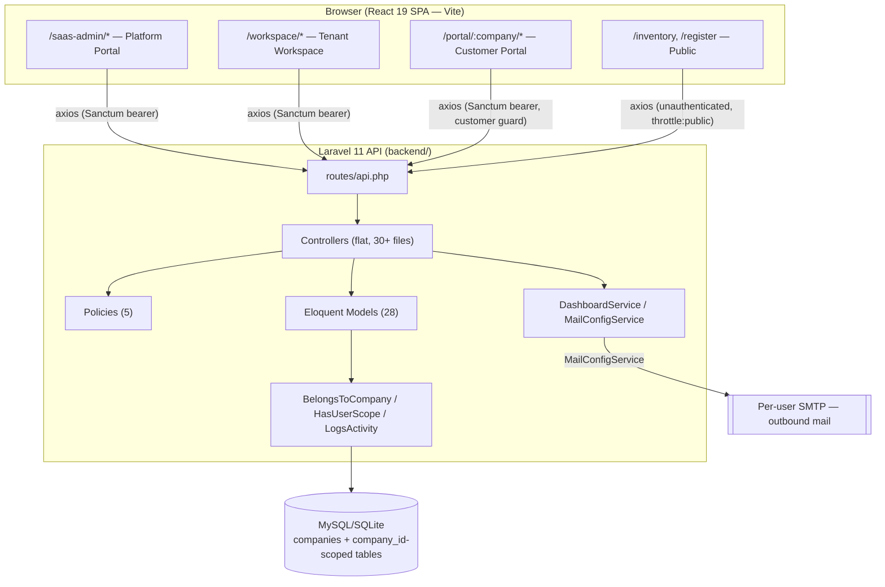
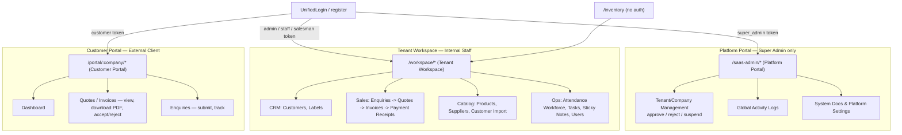
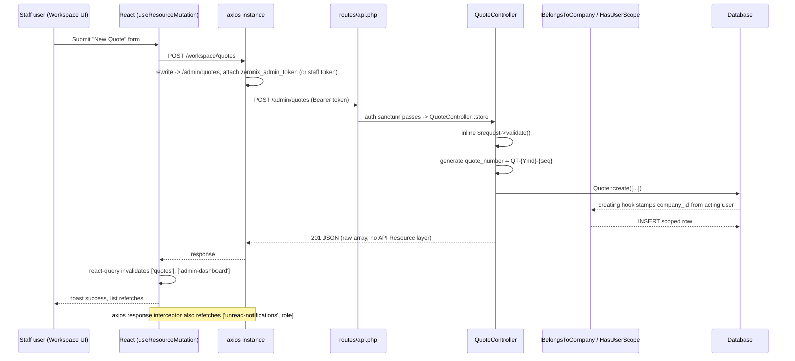
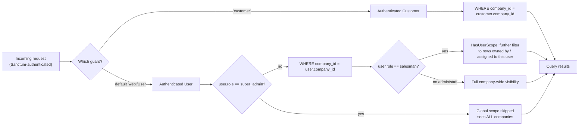
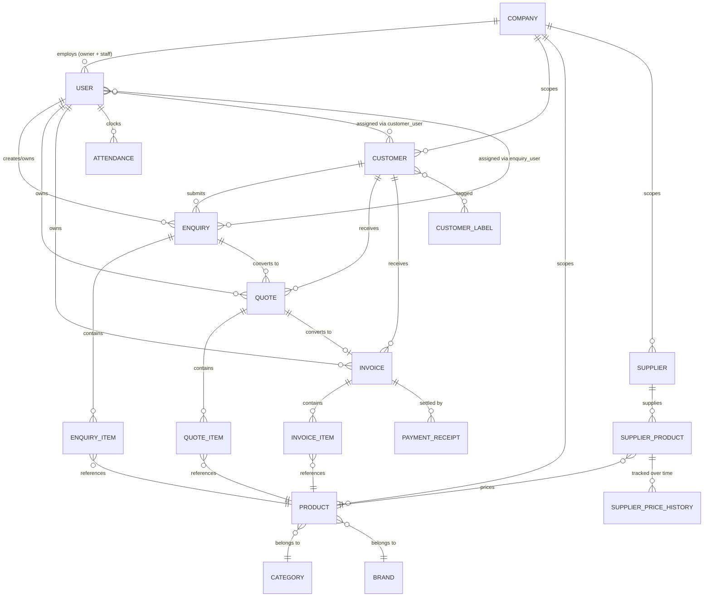
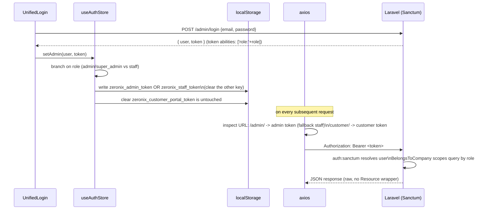

# Zeronix Portal — System Architecture

> Companion to `PROJECT_KNOWLEDGE.md`. This file focuses on structure, request flow, and module interaction diagrams. See `PROJECT_KNOWLEDGE.md` for narrative detail, file paths, and caveats.

---

## 1. High-level system map



> Note: the Chat module (Pusher/Echo realtime broadcasting) and the IMAP `SyncCustomerEmails` cron were removed 2026-07-05; the app no longer has a realtime or inbound-email path. Notification badges refresh via axios response-interceptor refetch (see §6), not websockets.

**Key facts baked into this diagram:**
- Both `/saas-admin` and `/workspace` frontends call the **same** `/admin/*` backend routes — the axios request interceptor rewrites both prefixes to `/admin/` before the call leaves the browser. Role separation happens via the bearer token, not the URL.
- Tenancy is enforced entirely inside the Eloquent layer (`BelongsToCompany` global scope), not at the routing or controller layer.
- There is no service/resource/middleware layer between controllers and models — controllers talk directly to Eloquent and to Services.

---

## 2. Three-portal + public domain structure



Note: `/admin` and `/staff` are legacy URL aliases that redirect to `/workspace` — kept for backward-compatible bookmarks/links during the ongoing rename (see `PROJECT_KNOWLEDGE.md` §5).

---

## 3. Request flow — authenticated staff action (e.g. creating a Quote)



---

## 4. Multi-tenancy data scoping



Applies to every model using `BelongsToCompany` (User, Customer, Enquiry, Quote, Invoice, Product, Task, Supplier, Category, Brand, CustomerLabel, PaymentReceipt, StickyNote).

---

## 5. Entity relationship overview (core sales pipeline)



---

## 6. Frontend module interaction

```mermaid
graph TD
    App[App.tsx — route tree] --> Guard[ProtectedRoute\nAdminRoute / CustomerRoute]
    Guard --> Layout[AdminLayout — shared shell\nSidebar + Topbar + MobileBottomNav]
    Layout --> Pages[pages/platform, pages/workspace, pages/portal]

    Pages --> RLP[ResourceListingPage\n(shared list/table component)]
    Pages --> Direct[Direct axios calls\nvia lib/axios]

    RLP --> UseApi[hooks/useApi.ts\nuseResourceList / useResourceMutation]
    UseApi --> RQ[React Query cache]
    RQ --> Axios[lib/axios.ts\ninterceptors: path rewrite, token select]
    Direct --> Axios
    Axios --> API[(Laravel API)]

    AuthStore[store/useAuthStore\nzustand + manual localStorage] -.token.-> Axios
    Axios -->|refetch on success| Notif[['unread-notifications', role]]
```

---

## 7. Auth token lifecycle



---

## 8. Known structural risks (see `PROJECT_KNOWLEDGE.md` for full detail)

1. **No API Resource/Middleware/Request layer** — all validation and serialization is inline in controllers; changes to response shape require touching every controller individually.
2. **`permissions` enforcement is frontend-only** — the backend does not re-check the `users.permissions` JSON column; treat it as UX polish, not a security boundary.
3. **`.env.example` is out of sync** — missing `FRONTEND_URL` (and, until pruned, stale Pusher/IMAP vars) relative to what the app requires at runtime.
4. **No automated tests** on either side of the stack.
5. **In-flight rename** — `/admin`+`/staff` → `/workspace`, legacy CSS token layer, possibly-dead `CustomerLayout.tsx` — verify before removing anything that looks like leftover scaffolding.
6. **Orphaned artifacts from the 2026-07-05 Chat/Bulk-Import removal** — unused `chat_conversations`/`chat_messages` tables (migrations retained), and now-unused deps (`pusher/pusher-php-server`, `webklex/laravel-imap`, `laravel-echo`, `pusher-js`) plus `MailConfigService`'s dead IMAP helper — safe to prune in a follow-up.

---

## 9. Diagram maintenance note

These diagrams reflect the code as of commit `337134b9` ("Implement multi-tenancy and restructure portal/workspace pages"). Multi-tenancy (`companies` table + `company_id` scoping) is the newest architectural layer (added 2026-06-16) — re-verify this file if further tenancy or routing restructures land.
