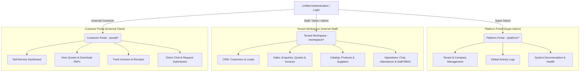

# Zeronix Portal — Multi-Tenant B2B CRM & Enterprise Sales Pipeline

## 1. Executive Summary & Project Vision

**Zeronix Portal** is an enterprise-grade, multi-tenant B2B Customer Relationship Management (CRM) and Sales Pipeline platform designed for high-efficiency sales teams, wholesale distributors, and service providers. 

The application bridges the gap between internal sales operations and external customer self-service by providing a unified, real-time ecosystem. It streamlines the lifecycle from lead/enquiry generation to formal quote calculation, invoicing, payment receipt tracking, and ongoing customer communication.

---

## 2. Three-Tier Portal Architecture

To support scalable multi-tenancy and strict role isolation, the frontend and backend are structured into three distinct operational domains:



### I. Platform Portal (`/platform/*`)
* **Target Users:** Super Administrators and Platform Owners.
* **Responsibilities:** Multi-tenant onboarding, company workspace creation, global system monitoring, platform-wide activity logs, and system documentation.

### II. Tenant Workspace (`/workspace/*`)
* **Target Users:** Internal Company Staff (Sales Representatives, Managers, Company Admins, Finance).
* **Responsibilities:**
  * **CRM & Leads:** Full lifecycle customer management, TRN/VAT tracking, and automated customer code generation (`ZRNX-CUS`).
  * **Sales Pipeline:** Dynamic enquiry conversion into formal quotations (`ZRNX-QT`) and tax-compliant invoices (`ZRNX-INV`).
  * **Inventory & Suppliers:** Product catalog maintenance, wholesale pricing tiers, and supplier profiles.
  * **Operations:** Internal/external messaging, staff attendance reporting, and role-based access control (RBAC).

### III. Customer Portal (`/portal/*`)
* **Target Users:** External Clients and Verified Customers.
* **Responsibilities:** A dedicated, branded self-service interface where clients can submit new enquiries, review and accept quotes, track invoice settlement statuses, download PDF documents, and chat directly with assigned sales representatives.

---

## 3. Design System & UI/UX Theme

Zeronix Portal employs a **Modern SaaS Executive Theme**, prioritizing visual clarity, high information density, and responsive micro-interactions.

### Aesthetics & Visual Philosophy
* **Vibrant & Premium:** Combines deep, sleek dark mode surfaces with high-contrast vibrant accents and subtle glassmorphism effects.
* **Focus & Ergonomics:** Replaces harsh default shadows and borders with clean focus rings (`#8B5CF6`) and refined typography hierarchy.
* **Dynamic Feedback:** Smooth micro-animations (fade-ins, pulse badges for urgent statuses, and custom scrollbars) ensure the interface feels responsive and alive.

### Color Palette Tokens
The design system is governed by CSS variables defined in `frontend/src/index.css`, supporting seamless Light and Dark mode switching:

| Token / Role | Hex Code / Value | Usage Description |
| :--- | :--- | :--- |
| **Brand Primary (Dark)** | `#111827` / `#0B131C` | Deep neutral slate used for primary text, dark backgrounds, and structural layouts. |
| **Brand Surface** | `#F3F4F6` / `#1E2E3E` | Card backgrounds, sidebar containers, and elevated UI elements. |
| **Brand Accent (Violet)** | `#8B5CF6` | Primary action buttons, active sidebar links, focus rings, and interactive highlights. |
| **Brand Accent Light** | `#EDE9FE` / `#C4B5FD` | Subtle hover states, badge backgrounds, and secondary accents. |
| **Success (Green)** | `#10B981` | Positive financial statuses (Paid, Approved), growth metrics, and Zeronix brand legacy highlights. |
| **Warning (Amber)** | `#F59E0B` | Pending approvals, draft quotes, and urgent notifications. |
| **Danger (Red)** | `#EF4444` | Overdue invoices, rejected quotes, and destructive actions. |
| **Info (Blue)** | `#3B82F6` | Informational callouts, active chat bubbles, and general tooltips. |

### Typography & Layout
* **Primary Font:** `Inter` (Google Fonts) for clean, legible UI text across all density scales (`10px` to `28px`).
* **Monospace Font:** `JetBrains Mono` for SKU numbers, invoice codes, financial amounts, and technical IDs.
* **Layout Structure:** Fixed collapsible sidebar (`210px` width) paired with an sticky topbar (`56px` height). Optimized for mobile devices with safe-area padding and touch-friendly scrolling (`-webkit-overflow-scrolling: touch`).

---

## 4. Technology Stack & Architectural Standards

### Backend (Laravel Mono-Folder)
* **Framework:** Laravel 11+ (PHP 8.2+).
* **Root Scope:** Strictly contained within `/backend/`.
* **Architecture:** Lean bootstrap routing with zero redundant providers.
* **Data Serialization:** Strictly enforced Laravel API Resources (`backend/app/Http/Resources/`). Eloquent collections or raw arrays are never exposed directly to client responses.
* **Multi-Tenancy Isolation:** Implemented via the `Company` model and enforced across Eloquent models using the `BelongsToCompany` trait and database-level foreign key scoping (`company_id`).
* **PDF & Email Engine:** DomPDF integration for dynamic document rendering; per-user SMTP configuration allowing sales representatives to dispatch emails from personal business domains.

### Frontend (React Mono-Folder)
* **Framework:** React 18+ with TypeScript, bundled via Vite.
* **Root Scope:** Strictly contained within `/frontend/`.
* **State Management:**
  * **Server State:** TanStack React Query for caching, pagination, and optimistic UI updates.
  * **Client/Auth State:** Zustand (`useAuthStore`) for lightweight, persistent authentication and role tracking.
* **Styling & Assets:** Tailwind CSS (v4 engine via `@tailwindcss/vite` / utility-first classes) and Lucide React iconography.
* **HTTP Client:** Axios with centralized interceptors for token injection, base path resolution (`useBasePath`), and automated error handling.

---

## 5. Development & Execution Commands

When contributing to or testing the Zeronix Portal codebase, follow these strict terminal execution standards:

```bash
# 1. Backend Testing & Verification
cd backend
php artisan test --filter=[TestName]

# 2. Frontend Test Suite
cd frontend
npm run test

# 3. Frontend Development Server (Visual UI Compilation)
cd frontend
npm run dev
```

---

## 6. Security & Data Scoping Guardrails

1. **Strict Role-Based Access Control (RBAC):** Middleware and frontend route guards (`ProtectedRoute.tsx`) validate user designations before rendering module views.
2. **Tenant Isolation:** All database queries in the workspace scope are automatically bound to the authenticated user's assigned `company_id`.
3. **Data Hygiene:** Input validation is enforced at both the TypeScript interface level and Laravel Request Form Validation layer.
